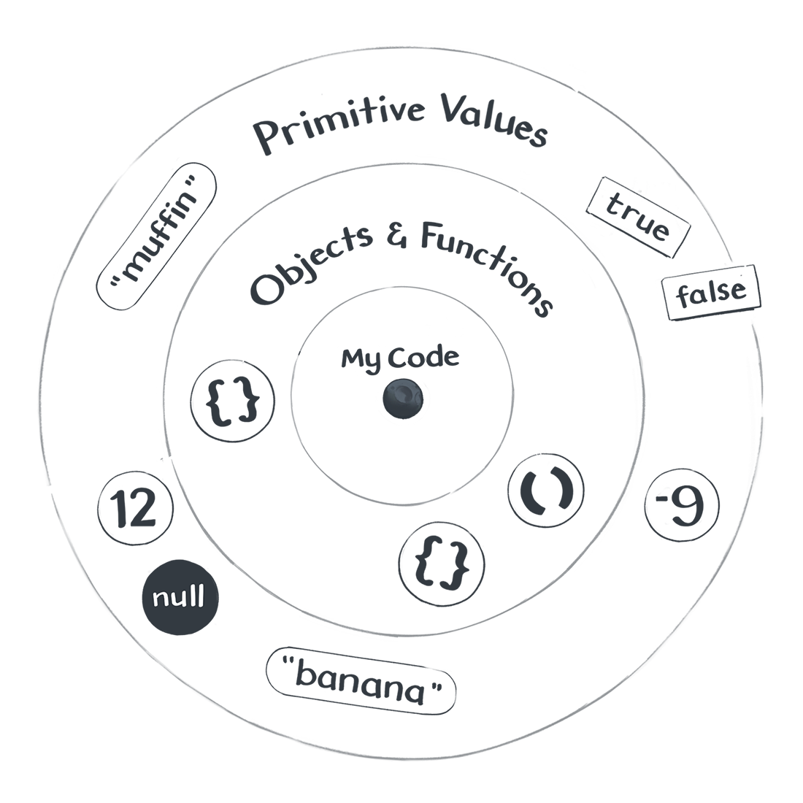
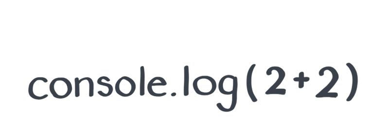
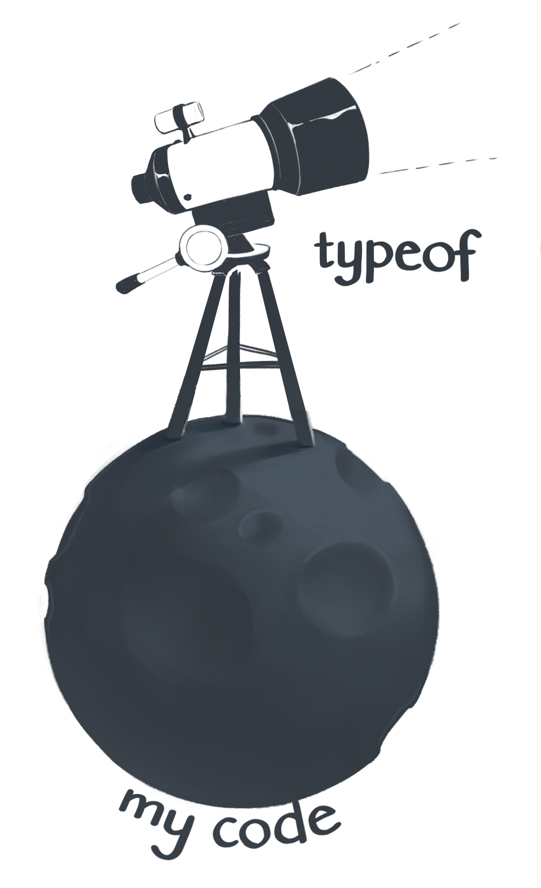
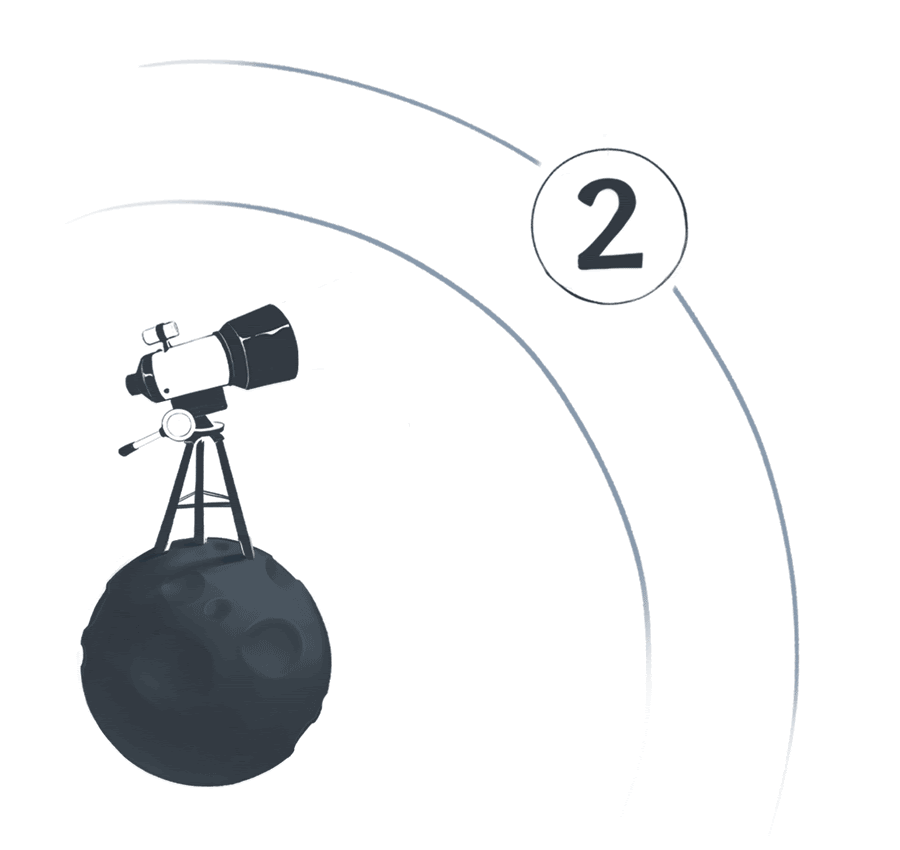

_In the beginning was the Value._

What _is_ a value? It’s hard to say.

This is like asking what a number is in math, or what a point is in geometry. __A value is a thing in the JavaScript universe.__

Numbers are values — but so are a few other things, like objects and functions. However, many things, such as an if statement or a variable declaration, are not values.

# Code and Values

To distinguish values from everything else in my JavaScript program, I like to imagine this drawing of the Little Prince by Antoine de Saint-Exupéry:


I’m standing on a small asteroid — it is the code of my program.
On its surface, I see the if statements and variable declarations, commas, curly braces, and all the other things one might find in the JavaScript code.

My code contains instructions like “make a function call” or “do this thing many times”, or even “throw an error”. I walk through these instructions step by step — running errands from my small asteroid.

_But every once in a while, I look up._

On a clear night, I see the different values in the JavaScript sky: booleans, numbers, strings, symbols, functions and objects, null and undefined — oh my! I might refer to them in my code, but they don’t exist inside my code.

_In my JavaScript universe, values float in space._



“Hold on,“ you might say, “I always thought of values as being inside of my code!” Here, I’m asking you to take a leap of faith. It will take a few more modules for this mental model to pay off. [give it five minutes](https://el2.convertkit-mail.com/c/o8u6mnrnqvawu40o42tv/58hvh8uokpzq75/aHR0cHM6Ly9zaWduYWx2bm9pc2UuY29tL3Bvc3RzLzMxMjQtZ2l2ZS1pdC1maXZlLW1pbnV0ZXM=)

Back to values. Broadly, there are two kinds of them.

## Primitive Values

Primitive Values are numbers and strings, among other things. Open your browser's console and print these primitive values using console.log():

```js
console.log(2);
console.log("hello");
console.log(undefined);
```

All primitive values have something in common. __There’s nothing I can do in my code that would affect them.__ This sounds a bit vague, so we’ll explore what this means concretely in the next module. For now, I’ll say that primitive values are like stars — cold and distant, but always there when I need them.

_That’s the first kind of values._

## Objects and Functions

Objects and Functions are also values, but they are not primitive. This makes them very special. Go ahead and log a few of them to the browser console:

```js
console.log({});
console.log([]);
console.log(x => x * 2);
```

Notice how the browser console displays them differently from the primitive values. Some browsers might display an arrow before them, or do something special when you click them. If you have a few different browsers installed (e.g. Chrome and Firefox), compare how they visualize objects and functions.

Objects and functions are special because I can manipulate them from my code. For example, I can connect them to other values. This is rather vague — so we’ll refine this idea in a later module. For now, I can say that if primitive values are like distant stars, then objects and functions are more like rocks floating nearby my code. They’re close enough that I can manipulate them.

_And that’s the second kind of values._

You might have questions. Good. If you ask a question, the JavaScript universe might answer it! Provided, of course, that you know how to ask.

## Expressions

There are many questions JavaScript can’t answer. If you want to know whether it’s better to confess your true feelings to your best friend or to keep waiting until you both turn into skeletons, JavaScript won’t be of much help.

But there are some questions that JavaScript would be delighted to answer. These questions have a special name — they are called expressions.

If we “ask” the expression 2 + 2, JavaScript will “answer” with the value 4.

```js
console.log(2 + 2); // 4
```

__Expressions are questions that JavaScript can answer. JavaScript answers expressions in the only way it knows how — with values.__




If the word “expression” confuses you, think of it as a piece of code that expresses a value. You might hear people say that 2 + 2 “results in” or “evaluates to” 4. These are all different ways to say the same thing.

We ask JavaScript 2 + 2, and it answers with 4. Expressions always result in a single value. Now we know enough about expressions to be dangerous!

I previously said that there are many types of JavaScript values: numbers, strings, objects, and so on. How do we know any particular value’s type?

_This sounds like a question. Do we dare to ask it?_

## Checking a Type

At first, all values in the JavaScript cosmos might look the same — bright dots in the sky. But if you look closely, you’ll realize there are fewer than ten different types of values. Values of the same type behave in similar ways.

If we want to check a value’s type, we can ask it with the typeof operator. JavaScript will answer our question with one of the predetermined string values, such as `"number"`, `"string"`, or `"object"`.



Below are a few examples you can try in the browser console:

```js
console.log(typeof(2)); // "number"
console.log(typeof("hello")); // "string"
console.log(typeof(undefined)); // "undefined"
```

Here, `typeof(2)` is an expression — and it results in the `"number"` value.

Strictly saying, using parens isn’t required with `typeof`. For example, `typeof 2` would work just as fine as `typeof(2)`. However, sometimes parens are required to avoid an ambiguity. One of the cases below would break if we omitted the parens after `typeof`. Try to guess which one it is:

```js
console.log(typeof({})); // "object"
console.log(typeof([])); // "object"
console.log(typeof(x => x * 2)); // "function"
```

You can verify your guess in the browser console.


Using typeof

Now take another look at the last three examples — this time with close attention to their results. Did you find any of these results surprising? Why?

# Types of Values

As an aspiring astronomer, you might want to know about every type of value that can be observed in the JavaScript sky. After almost twenty five years of studying JavaScript, the scientists have only discovered nine such types:

## Primitive Values

- __Undefined__ (`undefined`), used for unintentionally missing values.
- __Null__ (`null`), used for intentionally missing values.
- __Booleans__ (`true` and `false`), used for logical operations.
- __Numbers__ (`-100`, `3.14`, and others), used for math calculations.
- __Strings__ (`"hello"`, `"abracadabra"`, and others), used for text.
- __Symbols__ (uncommon), used to hide implementation details.
- __BigInts__ (uncommon and new), used for math on big numbers.

## Objects and Functions

- __Objects__ (`{}` and others), used to group related data and code.
- __Functions__ (`x => x * 2` and others), used to refer to code.

## No Other Types

You might ask: “But what about other types I have used, like arrays?”

__In JavaScript, there are no other fundamental value types other than the ones we have just enumerated.__ The rest are all objects! For example, even arrays, dates, and regular expressions fundamentally are objects in JavaScript:

```js
console.log(typeof([])); // "object"
console.log(typeof(new Date())); // "object"
console.log(typeof(/(hello|goodbye)/)); // "object"
```

“I see,” you might reply, “this is because _everything_ is an object!” Alas, this is a popular urban legend, but it’s not true. Although code like `"hi".toUpperCase()` makes `"hi"` seem like an object, this is nothing but an illusion. JavaScript creates a wrapper object when you do this, and then immediately discards it.

It’s fine if this mechanism doesn’t quite click yet. __For now, you only need to remember that primitive values, such as numbers and strings, are not objects.__

## Recap

Let’s recap what we know so far:

1. __There are values, and then there’s everything else.__ We can think of values as different things “floating” in our JavaScript universe. They don’t exist inside our code, but we can refer to them from our code.

2. __There are two categories of values: there are Primitive Values, and then there are Objects and Functions.__ In total, there are nine separate types. Each type serves a specific purpose, but some are rarely used.

3. __Some values are lonely.__ For example, null is the only value of the Null type, and undefined is the only value of the Undefined type. As we will learn later, these two lonely values are quite the troublemakers!

4. __We can ask questions with expressions.__ JavaScript will answer to us with values. For example, the 2 + 2 expression is answered with 4.

5. __We can inspect the type of something by wrapping it in a typeof expression.__ For example, typeof(4) is the string value "number".

# Exercises

Now it’s time to put what we learned to action.

Even if you already have a decent amount of experience with JavaScript don't skip the exercise questions! I personally learned some of these things only a few years ago.

[Click here to answer these questions](https://eggheadio.typeform.com/to/PLyTKB) and provide feedback about this module.

Next up we will explore the Primitive Values in more detail. We look at what these different primitive types like numbers and Null have in common, and learn a thing or two about what equality means in JavaScript.

We will also continue to refine our mental model. This module presents a crude sketch — an approximation. We will focus on different parts of the picture and fill them in with more details, like a [progressive JPEG](https://el2.convertkit-mail.com/c/o8u6mnrnqvawu40o42tv/2zi2h9u04re6no/aHR0cHM6Ly93d3cubGlxdWlkd2ViLmNvbS9rYi93aGF0LWlzLWEtcHJvZ3Jlc3NpdmUtanBlZy8=) image.

These might seem like small steps, but we’re laying the foundation for everything else to come. We’re building the JavaScript universe, together.
