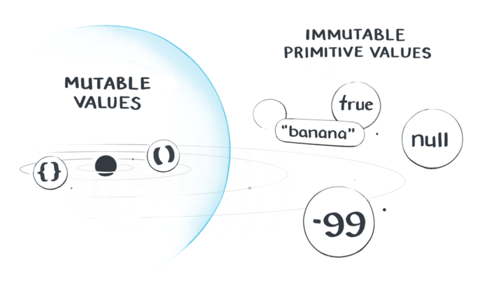
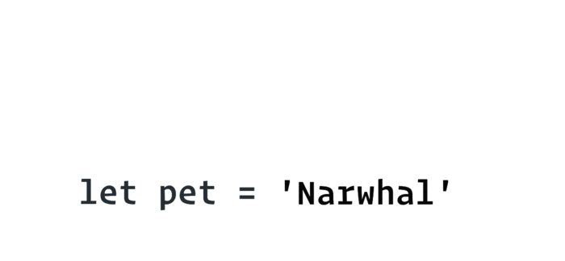
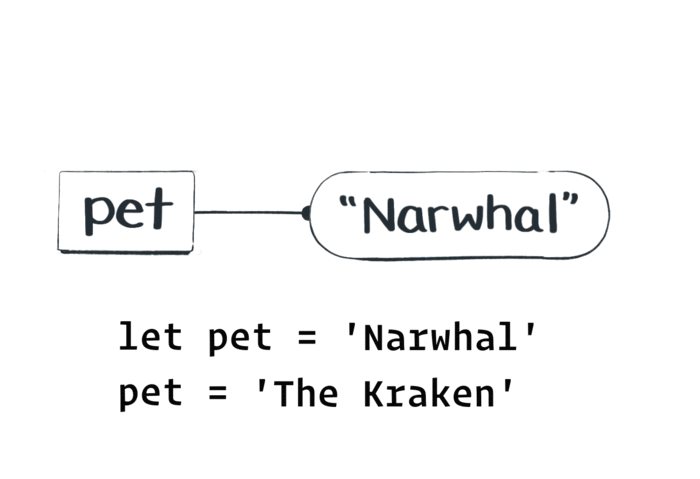
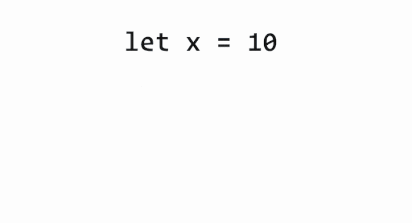
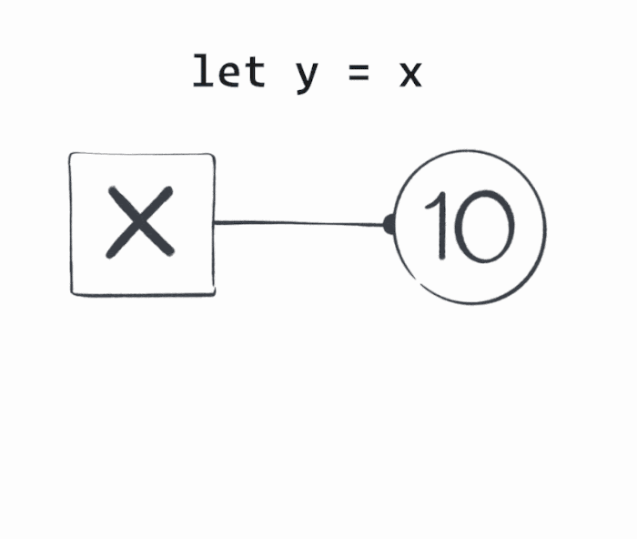

Let’s review the answers to the exercises from The JavaScript Universe module:

- __typeof(value) === "date" is always false__. This is because "date" is not one of the possible typeof results. 
Dates are not one of the primitive types (unlike numbers and booleans), and they are also not functions. So typeof for a date is always going to be "object".

- __The value that lies about its type is null__. Concretely, typeof(null) is "object" even though null is [not](https://www.ecma-international.org/ecma-262/10.0/?ck_subscriber_id=703698424#sec-terms-and-definitions-null-type) an object. Null is a primitive value. (Here’s a [historical note](https://2ality.com/2013/10/typeof-null.html) on how that happened.) This is a very old bug in JavaScript. It cannot be fixed because it would break existing websites. You might ask: isn’t typeof([]) === "object" a bug? No. Arrays aren’t primitive, so they are objects! Unlike null, they’re telling the truth.

- __typeof(typeof(value)) is always "string"__. Here’s why. We know typeof(value) always gives us one of the predetermined strings: "undefined", "boolean", "number", and so on. Predetermined strings. So typeof any of them is "string". Because they’re strings!

Now let’s get going.

We’ll kick off this module with a little code snippet.

```js 
let reaction = 'yikes';
reaction[0] = 'l';
console.log(reaction); 
```


What do you expect it to do? We haven’t covered this yet so it’s okay if you’re not sure. __Try to answer it using your current knowledge of JavaScript.__
Now I want you to take a few moments and write down your exact thinking process for each line of this code, step by step. Pay attention to any gaps or uncertainties in your existing mental model, and write them down too. If you have any doubts about it, try to articulate them as clearly as you can.


__SPOILERS BELOW__

Don’t scroll further until you have finished writing.

...

...

...

...

...

...

...

...

...

...


Here’s the answer. This code will either print "yikes" or throw an error depending on whether you are in [strict mode](https://developer.mozilla.org/en-US/docs/Web/JavaScript/Reference/Strict_mode?ck_subscriber_id=703698424). __It will never print "likes".__

Yikes.

# Primitive Values Are Immutable

Did you get the answer right? This might seem like a trivia question, the kind that people ask in JavaScript interviews but that doesn’t come up much in practice. Even so, it illustrates an important point about primitive values.

__I can’t change primitive values.__

I will explain this with a small example. Strings (which are primitive) and arrays (which are not — they’re objects!) have some superficial similarities. An array is a sequence of items, and a string is a sequence of characters:

```js
let arr = [212, 8, 506];
let str = 'hello';
```

You can access the first array item similarly to how you would access a string’s first character. It almost feels like strings are arrays (but they’re not!):

```js
console.log(arr[0]); // 212
console.log(str[0]); // "h"
```

You can change an array’s first item:

```js
arr[0] = 420;
console.log(arr); // [420, 8, 506]
```

So intuitively, it’s easy to assume that you can do the same to a string:

```js
str[0] = 'j'; // ???
```

__But you can’t.__

Here’s an important bit that we need to add to our mental model. A string is a primitive value. And that means a great deal!

__All primitive values are immutable.__ “Immutable” is a fancy Latin way to say “unchangeable”. Read-only. You can’t mess with primitive values. At all.

If you attempt to set a property on a primitive value, be it a number or a string or something else, JavaScript won’t let you do that. Whether it will silently refuse your request or error depends on [which mode](https://developer.mozilla.org/en-US/docs/Web/JavaScript/Reference/Strict_mode?ck_subscriber_id=810733667) your code is running in.

But stay assured that this will never work:

```js
let fifty = 50;
fifty.shades = 'gray'; // No!
```

Like any number, 50 is a primitive value, and you can’t set properties on it.


[Can’t touch this.](https://www.youtube.com/watch?v=otCpCn0l4Wo&ck_subscriber_id=810733667)

In my JavaScript universe, all primitive values exist in the outer circle further from my code — like distant stars. This reminds me that even though I can refer to them from my code, I can’t change them. They stay what they are.

_I find it strangely comforting._



# A Contradiction?

I have just demonstrated that primitive values are read-only — or, in the parlance of our times, immutable. Here’s a snippet to test your mental model.

```js
let pet = 'Narwhal';
pet = 'The Kraken';
console.log(pet); // ?
```

Like before, write down your thinking process in a few sentences. Don’t rush ahead. Pay close attention to how you’re thinking about each line, step by step. Does immutability of strings play a role here, and what role does it play?

__SPOILER ALERT__

...

...

...

...

...

...

...

...

...

...

If you thought I was trying to mess with your head, you were completely right! The answer is _"The Kraken"_ — immutability of strings doesn’t play a role.

Don’t despair if you got it wrong and haven’t seen it coming! These two last examples may definitely seem like they’re contradicting each other.

_This is an important realization._

When you’re new to a language, it might be tempting to ignore contradictions. After all, if you chase every contradiction, you’ll get into a rabbit hole too deep to learn anything. But now that you are committed to building a mental model, you need to question contradictions. They reveal gaps in mental models.

# Variables Are Wires

Let’s look at this example again.

```js
let pet = 'Narwhal';
pet = 'The Kraken';
console.log(pet); // "The Kraken"
```

We know that string values can’t change because they are primitive. But the pet variable does change to _"The Kraken"_. What’s up with that?

This might seem like it’s a contradiction, but it’s not. We only said it’s the primitive _values_ that can’t change. We didn’t say anything about _variables_!

As we refine our mental model, we might need to untangle related concepts.

__Variables are not values.__

_Variables point to values._

In my universe, a variable is a wire. It has two ends and a direction: it starts from a name in my code and it ends pointing at some value in my universe.

For example, I can point the pet variable at the _"Narwhal"_ value:

```js
let pet = 'Narwhal';
```



There are two things I can do to a variable after that.

## Assigning a Value to a Variable

One thing I can do is to assign some other value to my variable:

```js
pet = 'The Kraken';
```




All I am doing here is instructing JavaScript to point the “wire” on the left side (my pet variable) at the value on the right side ('The Kraken'). It will keep pointing at that value unless I re-assign it again later.

Note that I can’t just put _anything_ on the left side:

```js
'war' = 'peace'; // Nope. (Try it in the console.)
```

__The left side of an assignment must be a “wire”.__ For now, we only know that variables are “wires”. But there is another kind of “wire” we’ll talk about in a later module. Perhaps, you can guess what it is? (Hint: it involves square brackets or a dot, and we’ve already seen it a couple of times.)

There’s also another rule.

__The right side of an assignment must be an expression.__ It can be something simple, like 2 or 'hello', or a more complicated expression — for example:

```js
pet = count + ' Dalmatians';
```

Here, count + ' Dalmatians' is an expression — a question to JavaScript. JavaScript will answer it with a value (for example, "101 Dalmatians"). From now on, the pet “wire” will start pointing to that value.

If the right side must be an expression, does this mean that numbers like 2 or strings like 'The Kraken' written in code are also expressions? Yes! Such expressions are called _literals_ — because we _literally_ write down their values.


 # Reading a Value of a Variable

I can also _read_ the value of variable — for example, to log it:

```js
console.log(pet);
```

That’s hardly surprising.

But note that it is not the pet _variable_ that we pass to console.log. We might say that colloquially, but we can’t really pass _variables_ to functions. We pass the current _value_ of the pet variable. How does this work?

It turns out that a variable name like pet can serve as an expression too! When we write pet, we’re asking JavaScript a question: “What is the current value of pet?” To answer our question, JavaScript follows the pet’s “wire”, and gives us back the value at the end of this “wire”.

So the same expression can give us different values at different times!

# Nouns and Verbs

Who cares if you say “pass a variable” or “pass a value”? Isn’t the difference hopelessly pedantic? I certainly don’t encourage interrupting your colleagues to correct them — or even yourself. That would be a waste of everyone’s time.

But in your mind you need to have clarity on _what you can do_ with each concept. You can’t skate a bike. You can’t fly an avocado. You can’t sing a mosquito. And you can’t pass a variable — at least, not in JavaScript.

Here’s a small example of why these details matter.

```js 
function double(x) {
  x = x * 2;
}

let money = 10;
double(money);
console.log(money); // ?
```

If we thought double(money) was passing a _variable_, we could expect that x = x * 2 would double that variable. But that’s not how it works. We know that double(money) means “figure out the _value_ of money, and then pass that _value_ to double”. So the answer is 10. What a scam!

What are the different JavaScript nouns and verbs in your head? How do they relate to each other? Write down a short list of the ones you use most often.

# Putting It Together
Now let’s revisit the first example from Mental Models:

```js
let x = 10;
let y = x;
x = 0;
```

I suggest that you take a piece of paper or a drawing app and sketch out a diagram of what happens to the “wires” of the x and y variables step by step.

__The first line doesn’t do much:__



- Declare a variable called x.
    - _Make a wire for the x variable._
- Assign to x the value of 10.
    - _Point x’s wire to the value 10._

__The second line is short, but it does quite a few things:__


-  Declare a variable called y.
    - _Make a wire for the y variable._
- Assign to y the value of x.
    - Evaluate the expression: x.
        - _The “question” we want to answer is x._
        - _Follow the x’s wire — the answer is the value 10._
    - The x expression resulted in the value 10.
    - Therefore, assign to y the value of 10.
    - _Point y’s wire to the value 10._

__Finally, we get to the third line:__



- Assign to x the value of 0.
    - _Point x’s wire to the value 0._

At the end, the x variable points to the value 0, and the y variable points to the value 10. Note that y = x did not mean point y to x”. We can’t point variables to each other! __Variables always point at values.__ When we see an assignment, we “ask” the right side’s value, and point the left side’s “wire” at it.

I mentioned in _Mental Models_ that it is fairly common to think of variables as boxes. The universe we’re building is not going to have any boxes at all. __It only has wires!__ This might seem a bit annoying. Why can’t we just “put 0 and 10 values _into_ the variables rather than _pointing_ variables to them?

Using wires is going to be very important for explaining numerous other concepts, like strict equality, object identity, and mutation. We’re going to stick with wires, so you might as well start getting used to them now!

_My universe is full of wires._

# Recap

- __Primitive values are immutable.__ There’s nothing we can do in our code to affect them or change them in any way. They stay what they are. For example, we can’t set a property on a string value because it is a primitive value. _Arrays_ are not primitive, so we can set their properties.

- __Variables are not values.__ Each variable _points_ to a particular value. We can change _which_ value it points to by using the = assignment operator.

- __Variables are like wires.__ A “wire” is not a JavaScript concept — but it helps us imagine how variables point to values. There’s also a different kind of “wire” that’s not a variable, but we haven’t discussed it yet.

- __Look out for contradictions.__ If two things that you learned seem to contradict each other, don’t get discouraged. Usually it’s a sign that there’s a deeper truth lurking underneath.

- __Nouns and verbs matter.__ We’re building a mental model so that we can be confident in what _can_ or _cannot_ happen in our universe. It’s fine to be sloppy in casual speech, but our thinking needs to be precise.

# Exercises
This module also has exercises for you to practice!

[__Click here__ to solidify this mental model with a few short exercises.](https://eggheadio.typeform.com/to/RWJg3m?email=dena.denacho@gmail.com&ck_subscriber_id=810733667)


__Don’t skip them!__

Even though you’re likely familiar with the concept of variables, these exercises will help you cement the mental model we’re building. We need this foundation before we can get to more complex topics.

