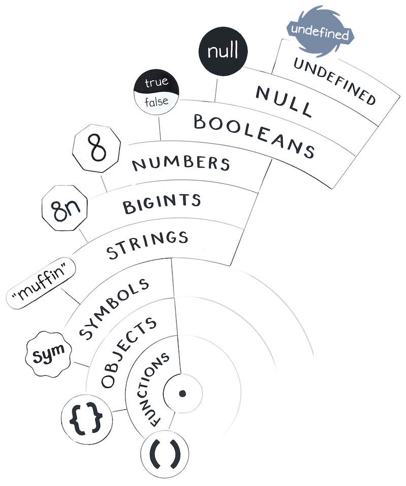

First, let’s review the answers to the [exercises from Values and Variables](https://eggheadio.typeform.com/to/RWJg3m). If you haven't completed the exercises you can do so now!

- __The first example logs "string", and the second example logs "number"__. Variables don’t have types in JavaScript — only values do. Even in TypeScript, typeof still checks values rather than variables! The answer to typeof(numberOfTentacles) depends on which value the variable was pointing to to at that time. In the first example, we essentially “asked” typeof('eight'), and in the second example we “asked” typeof(10). So we got "string" and "number".

- __The example where we assign answer.opposite while the answer is true won’t succeed in setting a property__. If our code runs in [strict mode](https://developer.mozilla.org/en-US/docs/Web/JavaScript/Reference/Strict_mode), assigning a property on a primitive value would lead to an error. Otherwise, it will silently do nothing. In either case, it won’t set the property because primitive values like true are immutable. We can’t change them — and setting a property on a value is a change.

- __Setting null = 10 also won’t work__. This one is always an error. It is an error because the left side of assignment must always be a “wire”. Variables are “wires”, so they can appear on the left side. A literal like null is not a “wire”, so trying to assign something to it is meaningless.

- __Out of four diagrams, the second one (“B”) matches our mental model best__. In the mental model we’re building, variables point to values! The “A” diagram shows variables as boxes. Although it’s technically possible to represent JavaScript with boxes, we’ll avoid using the boxes mental model because it complicates other topics. The problem with both “C” and “D” is that a variable points to another variable. This doesn’t work in JavaScript. _Variables can only point to values_, not to other variables! Changing which value a variable points to can’t affect other variables.

- __When we declare let pets = 'Tom and Jerry' and then pass pets to our colleague’s function in another file, pets[0] will stay 'T'__. This is because when we call a function, we always pass a value, not a variable. We’re passing a string value — _and strings, like any primitives, are immutable_. Our colleague can’t mess with the 'Tom and Jerry' string, so its first character will always be 'T'.

- __When we declare `let pets = ['Tom', 'Jerry']` and pass pets to our colleague’s function, `pets[0]` is not guaranteed to be 'Tom'__. Does this mean our colleague somehow changed the pets variable? Well, no. This is where the distinction between primitive values (like strings) and non-primitive values (like arrays) comes in. In both of these examples, our colleague can’t change which value our pets variable points to. But in this example, our colleague can affect the value itself. This is because unlike primitive values (such as strings and numbers), objects (including arrays) are mutable. Anyone can mess with them.

__Don’t worry about getting the last two questions wrong__

A keen reader might observe that we haven’t quite built up the mental models necessary to answer the last two questions with confidence. These questions expose some of the gaps we still need to fill! For example, we haven’t really talked about properties yet, or about what it means to “pass” a value.

Keep track of which mental model you’re using when answering a question. If words we haven’t discussed come up in your explanation, it might be a sign you’re mixing different mental models. It’s not bad — after all, the model we’re building is still very incomplete — but try to be conscious of those gaps.

Our goal is to fill them in, step by step.

In this module, we’ll take a closer look at the JavaScript world and the values in it. But before we can get to that, we need address the elephant in the room.

_Is the JavaScript world even real_?

# The JavaScript Simulation

When I ask the JavaScript world a question, it answers me with a value. I certainly don’t come up with all these values by myself. The variables, the wires, the values — they all populate my world. When I connect a variable’s wire to a value, I can physically feel doing it. How could it not be real?

But sometimes, there is a moment of silence before the next instruction. An idle tick before the next function call. A glitch in the Matrix. My whole world pauses for a moment — and during that moment, I might see a dream.

In my dream, I visit a world very different from mine. In that world, there are no variables and values. No expressions and no literals. Instead, there are quarks, and atoms, and electrons, and water, and life.

There, sentient beings called “humans” use special machines called “computers” to simulate my JavaScript universe. Some of them do it for amusement. Some of them do it for profit. Some of them do it for no reason at all. At their whim, my whole world gets born and dies a trillion times a day.


If you were a human planning to study JavaScript, how would you approach it? Perhaps, you might focus on how a simulation of my world — a JavaScript engine — really works. For example, you might learn that this string of text — a value in my world — is a sequence of bytes stored inside a silicon chip.

But my approach is different.

__My mental model does not attempt to answer questions like “How is a value represented in the computer memory?” The answer changes all the time!__

In fact, the answer to this question changes even [while your program is running](https://v8.dev/blog/react-cliff). If you heard of a simple explanation about how JavaScript “really” represents numbers, strings, or objects in memory, it is most likely wrong.

To me, each string is a value. Not a “pointer” or a “memory address” — but a value. __In my universe, a value is good enough__. Don’t allow “memory cells” and other low-level metaphors to distract you from building an accurate high-level mental model of JavaScript. [It’s turtles all the way down anyway!](https://en.wikipedia.org/wiki/Code:_The_Hidden_Language_of_Computer_Hardware_and_Software?ck_subscriber_id=703698424)

If you only learn using low-level mental models, you will struggle to reach a clear understanding of what can or cannot happen in JavaScript code. If you’re coming from a lower-level language, try to set aside your intuitions about “reference types”, “allocating on stack”, “copying on write”, and so on. We’ll look at some of the lower level details, but only [where it really matters](https://www.joelonsoftware.com/2002/11/11/the-law-of-leaky-abstractions/). They can serve as an addition to our mental model, rather than its foundation.

__Instead, the foundation of our mental model is that our world is full of values__. Each value belongs to one of a few built-in types. Some of them are primitive, which makes values of those types immutable. Variables are “wires” pointing from names in our code to values. And we’ll keep building on that foundation.

As for these strange dreams, I don’t pay as much thought to them anymore. I have wires to point, questions to ask, and functions to call. I better get to it!

The stars are bright when I look at them.

Are they still there when I blink?

I shrug.

“_Implementation details._”


# Counting the Values

[Count von Count](https://www.youtube.com/playlist?list=PL0X42Qp5X1DMzE2E6I5baBXu5HwAhuK_h) was my childhood role model. If you’re not familiar with him from the Sesame Street, his favorite pastime is counting things. Today, Count von Count will join us in counting every value in the JavaScript universe.

You might wonder: what’s the point of counting values? We’re not in an arithmetics class, are we? The essence of counting is to distinguish things from one another. You can only say there are “two apples” when you clearly see that they’re two distinct apples. Distinguishing values from one another is key to understanding equality in JavaScript — which will be our next topic.

Like Virgil guided Dante through the nine circles of Hell, Count von Count will accompany us through the “celestial spheres” of JavaScript to meet different values: Booleans, Numbers, Strings, and so on. Consider it a sightseeing tour.




## Undefined

We’ll start our tour with the Undefined type. Count von Count will be pleased to know that __there is only one value of that type — undefined.__

```js
console.log(typeof(undefined)); // "undefined"
```


It’s called undefined so you might think it’s not there — but it is a value, and a very real one! Like a black hole, undefined is grumpy and can often spell trouble. For example, reading a property from it will break your program:

```js
let person = undefined;
console.log(person.mood); // TypeError!
```

Oh, well. Luckily, there is only one undefined in the entire JavaScript universe. You might wonder: why does it exist at all? In JavaScript, it represents the concept of an _unintentionally_ missing value.

You could use it in your own code by writing undefined — like you write 2 or "hello". However, undefined also commonly “occurs naturally”. It shows up in some situations where JavaScript doesn’t know what value you wanted. For example, if you forget to assign a variable, it will point to undefined:

```js
let bandersnatch;
console.log(bandersnatch); // undefined
```


Then you can point it to another value, or to undefined again if you want.

Don’t get too hung up on its name. It’s tempting to think of undefined as some kind of variable status, e.g. “this variable is not yet defined”. But that’s a completely misleading way to think about it! In fact, if you read a variable that was actually not defined (or before the let declaration), you will get an error:

```js
console.log(jabberwocky); // ReferenceError!
let jabberwocky;
```

That has nothing to do with undefined.

Really, undefined is a regular primitive value, like 2 or "hello".

Handle it with care.

## Null


You can think of null as undefined’s sister. It behaves very similarly. For example, it will also throw a fuss when you try to access its properties:

```js
let mimsy = null;
console.log(mimsy.mood); // TypeError!
```


Similarly to undefined, __null is the only value of its own type.__ However, null is also a liar. Due to a [bug](https://2ality.com/2013/10/typeof-null.html) in JavaScript, it pretends to be an object:

```js
console.log(typeof(null)); // "object" (a lie!)
```

You might think this means null is an object. Don’t fall into this trap! It is a primitive value, and it doesn’t behave in any way like an object. Unfortunately, typeof(null) is a historical accident that we’ll have to live with forever.

In practice, null is used for intentionally missing values. Why have both null and undefined? This could help you distinguish a coding mistake (which might result in undefined) from valid missing data (which you might express as null). However, this is only a convention, and JavaScript doesn’t enforce this usage. Some people avoid both of them as much as possible!

I don’t blame them.

## Booleans


Like day and night, __there are only two boolean values: true and false.__

```js
console.log(typeof(true)); // "boolean"
console.log(typeof(false)); // "boolean"
```

We can perform logical operations with them:

``` js
let isSad = true;
let isHappy = !isSad; // The opposite
let isFeeling = isSad || isHappy; // Is at least one of them true?
let isConfusing = isSad && isHappy; // Are both true?
```

Count von Count would like to check your mental model now. Open a [sketching app](https://excalidraw.com/) or take a piece of paper, and sketch out the variables, the values, and the wires between them for the above snippet of code.


__SPOILERS BELOW__

Don’t scroll further until you have finished sketching.

...

...

...

...

...

...

...

...

...

...

Check your answer against this picture:


First, verify that isHappy points to false, isFeeling points to true, and isConfusing points to false. (If you got different answers, there is a mistake somewhere along the way — walk through each line step by step.)

Next, verify that __there is only one true and one false value on your sketch.__ Count von Count insists that this is important! Regardless of how booleans are stored in the memory, _in our mental model_ there are only two of them.

## Numbers


So far, we counted exactly four values: `null`, `undefined`, `true`, and `false`.

Hold on, as we will add eighteen quintillion, four hundred and thirty-seven quadrillion, seven hundred and thirty-six trillion, eight hundred and seventy-four billion, four hundred and fifty-four million, eight hundred and twelve thousand, six hundred and twenty-four more values to our mental model!

I am, of course, talking about numbers:

```js
console.log(typeof(28)); // "number"
console.log(typeof(3.14)); // "number"
console.log(typeof(-140)); // "number"
```

At first, numbers might seem unremarkable. Let’s look closer!

There is a popular urban legend that numbers in JavaScript are broken:

```js
console.log(0.1 + 0.2 === 0.3); // false
console.log(0.1 + 0.2 === 0.30000000000000004); // true
```

However, this behavior is not specific to JavaScript — and it [makes sense](https://0.30000000000000004.com/) if we remember that our JavaScript universe might, after all, be a simulation.

[Floating point](https://floating-point-gui.de/formats/fp/) math is a clever invention to express a wide range of numbers (including fractions) with a sequence of bits of a particular length (e.g. 64).

__That’s the kind of math that powers JavaScript numbers__.

It might remind you of digitizing a vinyl record: the input is analog, but the result necessarily “snaps” to the closest values that can be stored:


With floating point numbers, like we have in JavaScript, the precision itself is dynamic. The closer we are to 0, the more precision numbers have, and the closer they “sit” to each other:


As we move from 0 in either direction, we start losing precision. At some point, even two closest representable numbers stay further apart than by 1:

```js
console.log(Number.MAX_SAFE_INTEGER);     // 9007199254740991
console.log(Number.MAX_SAFE_INTEGER + 1); // 9007199254740992
console.log(Number.MAX_SAFE_INTEGER + 2); // 9007199254740992
console.log(Number.MAX_SAFE_INTEGER + 3); // 9007199254740994
console.log(Number.MAX_SAFE_INTEGER + 4); // 9007199254740996
console.log(Number.MAX_SAFE_INTEGER + 5); // 9007199254740996
```

This might seem confusing. However, for most practical calculations, floating point math works pretty well. It balances the tradeoffs of expressing a wide range of numbers, a reasonably high precision, and predictable memory use.

__In our JavaScript universe, there is exactly one number value for every mathematical number that can be represented with 64-bit floating point math__.

It is worth noting that floating point math includes a few special numbers. You might occasionally run into `NaN`, `Infinity`, `-Infinity`, and `-0`. They exist because sometimes you might execute operations like `1 / 0`, and JavaScript needs to represent their result somehow. The [floating point math standard](https://en.wikipedia.org/wiki/IEEE_754) specifies how they work, and what happens when you use them.

Here’s how special numbers may come up in your code:

```js
let scale = 0;
let a = 1 / scale; // Infinity
let b = 0 / scale; // NaN
let c = -a; // -Infinity
let d = 1 / c; // -0
```

Out of these special numbers, NaN is particularly interesting. NaN, which is the result of `0 / 0` and some other invalid math, stands for “not a number”.

You might be confused by why it claims to be a number:

```js
console.log(typeof(NaN)); // "number"
```

However, there is no trick here. From JavaScript perspective, NaN is a numeric value. It is not null, undefined, a string, or some other type. But in the floating point math, the name for that term is “not a number”. So it is a numeric value. It happens to be called “[not a number](https://en.wikipedia.org/wiki/NaN)” because it represents an invalid result.

__Let’s recap JavaScript numbers:__

- __JavaScript implements a standard called “floating point math”__. Its numbers are more precise closer to 0, and less precise further away from it.
- __Numbers resulting from invalid math operations like__ `1 / 0` or `0 / 0` __are special__. NaN is one of such special numbers.
- __typeof(NaN) is a number because it is a numeric value__. It’s called “Not a Number” because it represents the idea of an "invalid" number.
