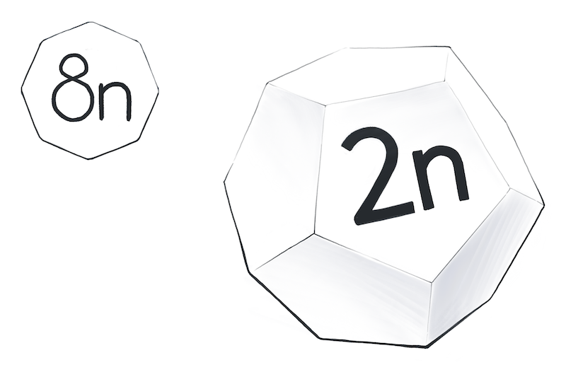
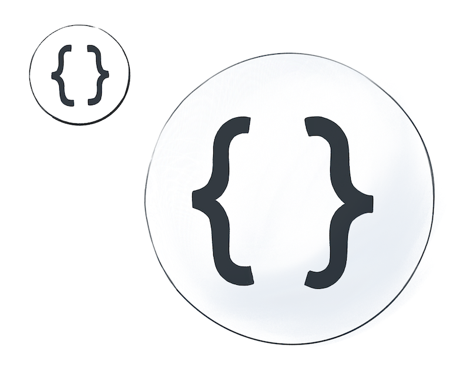
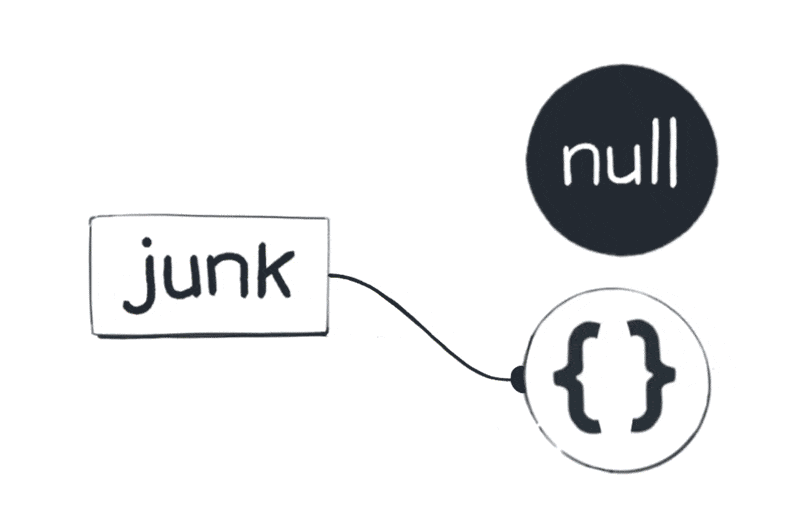

## BigInts



BigInts were only added in JavaScript, so you won’t see them used widely yet. If you use an older browser, they won’t work. Regular numbers can’t represent large integers with precision, so BigInts were [added](https://v8.dev/features/bigint) to fill that gap (literally):

```js
let alot = 9007199254740991n; // Notice n at the end
console.log(alot + 1n); // 9007199254740992n
console.log(alot + 2n); // 9007199254740993n
console.log(alot + 3n); // 9007199254740994n
console.log(alot + 4n); // 9007199254740995n
console.log(alot + 5n); // 9007199254740996n
```

No funny business with the rounding! This is great for financial calculations where precision is especially important. Keep in mind that nothing is free. Operations with truly huge numbers may take time and resources.

How many BigInts are there in our universe? The specification says they have an arbitrary precision. This means that __in our JavaScript universe, there is an infinite number of BigInts — one for each integer in math.__

Yeah...

If this sounds strange, consider that you’re already comfortable with the idea of there being infinite integers in math. (If you’re not, give it a few moments!) It’s not much of a leap then from a “math universe” to a “JavaScript universe”.

(And from there, we can go straight to the [Pepsi Universe](https://www.goldennumber.net/wp-content/uploads/pepsi-arnell-021109.pdf)

Of course, in practice, we can’t fit all the possible BigInts inside the computer memory. If we tried, at some point it would crash or freeze. But conceptually, Count von Count could be busy counting BigInts for eternity and never stop.

## Strings


Strings represent text in JavaScript. There are three ways to write strings (single quotes, double quotes, and backticks), but the result is the same:

```js
console.log(typeof("こんにちは")); // "string"
console.log(typeof('こんにちは')); // "string"
console.log(typeof(`こんにちは`)); // "string"
```

An empty string is a string, too:

```js
console.log(typeof('')); // "string"
```

All strings have a few built-in properties.

```js
let cat = 'Cheshire';
console.log(cat.length); // 8
console.log(cat[0]); // "C"
console.log(cat[1]); // "h"
```

This doesn’t mean that strings are objects! String properties are special and don’t behave the way object properties do. For example, you can’t assign anything to cat[0]. Strings are primitives, and all primitives are immutable.

__In our universe, there is a distinct value for every conceivable string__. Yes, this includes your grandmother’s maiden name, the fanfic you published ten years ago under an alias, and the script of Matrix 5 which hasn’t been written yet.

Of course, all possible strings can’t literally fit inside a computer memory chip. But the idea of every possible string can fit inside your head. Our JavaScript universe is a model for humans, not for computers!

This might prompt a question. Does this code create a string?

```js
// Try it in your console
let answer = prompt('Enter your name');
console.log(answer); // ?
```

Or does it merely summon a string that already exists in our universe?

Within our mental model, this question [doesn’t make sense](https://en.wikipedia.org/wiki/Falsifiability). We could say that strings appear in our universe the first time they used, and then “stick around”, or we could say that they have always been there. We can’t test our theory from within our program because the JavaScript memory semantics are not directly observable. So I prefer to imagine that all strings already exist.

In practice, of course, it depends on a specific implementation and specific circumstances. The string values are created as they’re needed, but whether a string is represented as a single block of memory, multiple blocks, [a rope](https://en.wikipedia.org/wiki/Rope_(data_structure)), or something else, and when it gets evicted, is up to the implementation. If you operate on huge strings, use a profiler to check your memory usage patterns.

But again, in our mental model, each distinct string already exists.

## Symbols

```js
let alohomora = Symbol();
console.log(typeof(alohomora)); // "symbol"
```

It’s hard to explain their purpose and behavior without diving deeper into objects and properties, so for now we’re going to skip them. Sorry, symbols!


## Objects



At last, we got to objects!

This includes arrays, dates, RegExps, and other non-primitive values:

```js
console.log(typeof({})); // "object"
console.log(typeof([])); // "object"
console.log(typeof(new Date())); // "object"
console.log(typeof(/\d+/)); // "object"
console.log(typeof(Math)); // "object"
```

Unlike everything before, objects are not primitive values. This also means that by default, they’re mutable. We can access their properties with . or []:

```js
let rapper = { name: 'Malicious' };
rapper.name = 'Malice'; // Dot notation
rapper['name'] = 'No Malice'; // Bracket notation
```

There is one thing in particular that makes Count von Count excited about objects. __We can make more of them! We can make our own objects__.

In our mental model, all of the primitive values we’ve discussed — null, undefined, booleans, numbers, and strings — have “always existed”. We can’t “make” a new string or a new number, we can only “summon” that value:

```js
let sisters = 3;
let musketeers = 3;
```


What makes objects different is that we can create more of them. __Every time we use the {} object literal, we create a brand new object value__:

```js
let shrek = {};
let donkey = {};
```


The same goes for arrays, dates, and any other objects. For example, the [] array literal creates a new array value — a value that never existed before.

You might wonder: do objects ever disappear, or do they hang around forever? JavaScript is designed in a way that this is not directly observable from our code (although that [might change](https://github.com/tc39/proposal-weakrefs)).

You can’t destroy an object that you’ve created:

```js
let junk = {};
junk = null; // Doesn't necessarily destroy an object
delete junk; // Doesn't do anything (and errors in strict mode)
```

JavaScript is a garbage-collected language. Practically, this means that values might eventually disappear from my universe if I can’t reach them by following any wires from my code.

But JavaScript doesn’t offer guarantees about when that happens.



For the most part, I don’t have to think about it. But if I ever need to debug a memory leak, the wires metaphor is a handy way to think about it.

_In my universe, objects and functions float closest to my code. This reminds me that I can manipulate them and even make more of them._


It is particularly strange to think about functions as values that are separate from my code. After all, they are my code. Or are they not?

Consider this example:

```js
for (let i = 0; i < 7; i++) {
  let dwarf = {};
  console.log(dwarf);
}
```

How many objects did we create? We haven’t talked about scopes yet, so it’s fine if you can’t figure out a diagram for this snippet of code yet. The answer is that we create seven objects — one in each iteration of the loop.

But now look at this example:

```js
for (let i = 0; i < 7; i++) {
  let dig = function() {
    // Do nothing
  };
  console.log(dig);
}
```

How many functions do you see here? Is it one function, or is it seven?

__SPOILERS BELOW__

...
...
...
...
...
...
...
...
...

The snippet above contains one function definition in the code, but it creates seven function values! This is why separating these concepts is important.

__Every time we execute a line of code that contains a function declaration, a brand new function value appears in our universe.__


This might remind you of how whenever we execute code like let dwarf = { }, a new object appears. We create objects, and we create functions. We’ll look at objects and functions in detail in future modules.

## Recap

That was quite a journey! We’ve looked at every value type in JavaScript. Let’s join Count von Count in recapping how many values there are of each type:


- __Undefined__: Only one value, undefined.
- __Null__: Only one value, null.
- __Booleans__: Two values: true and false.
- __Numbers__: One value for each [floating point math](https://en.wikipedia.org/wiki/Double-precision_floating-point_format) number.
- __BigInts__: One value for every conceivable integer.
- __Strings__: One value for every conceivable string.

The types below are special because they let us make our own values:


- __Objects__: One value for every object that we create.
- __Function__: One value for every function definition we step through.

It was fun to visit the different “celestial spheres” of JavaScript. Now that we’ve counted all the values, we’ve also learned what makes them distinct from one another. __For example, writing 2 or "hello" always “summons” the same number or a string value. But writing {} or declaring a function always creates a brand new, different value.__ This idea is crucial to understanding equality in JavaScript, which will be the topic of the next module.

## Exercises

This module also has exercises for you to practice!

[Click here to solidify this mental model with a few short exercises](https://eggheadio.typeform.com/to/iKrD7b)

__Don’t skip them!__

Even though you’re probably familiar with different types of values, these exercises will help you cement the mental model we’re building. We need this foundation before we can get to more complex topics.