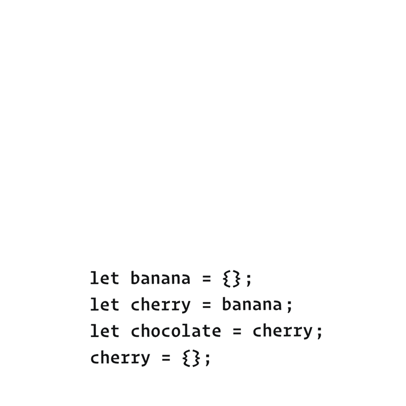
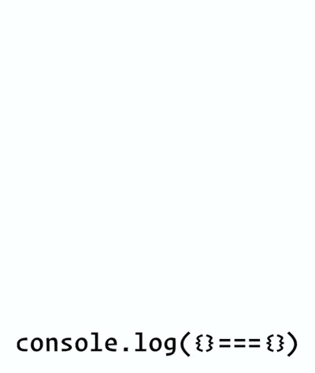

It’s time to talk about equality in JavaScript! Here’s why it matters.

Imagine negotiating business deals at a masked carnival. You might talk to two people, and not realize that you really talked to the same person twice. Or you might _think_ you talked to one person but those were two different people!


__If you don’t have a clear mental model of equality in JavaScript, every day is like a carnival – and not in a good way__. You’re never quite sure if you’re dealing with the same value, or with two different values. As a result, you’ll often make mistakes — like changing a value you didn’t intend to change.

Luckily, we’ve already done most of the work to establish the concept of equality in JavaScript. It fits into our mental model in a very natural way.

# Kinds of Equality

In JavaScript, there are several kinds of equality. If you’ve been writing JavaScript for a while, you’re probably familiar with at least two of them:

- __Strict Equality:__ `a === b` (triple equals).
- __Loose Equality:__ `a == b` (double equals).
- __Same Value Equality:__ `Object.is (a, b)`.

Most tutorials don’t mention the `Same Value Equality` at all. We’ll take a road less traveled, and explain it first. We can then use it to explain the other kinds.

## Same Value Equality: `Object.is(a, b)`

In JavaScript, `Object.is(a, b)` tells us if a and b are the same value:

```js
console.log(Object.is(2, 2)); // true
console.log(Object.is({}, {})); // false
```

This is called __Same Value Equality.__

What does “same value” means, exactly, in our mental model? You might already know this intuitively, but let’s verify your understanding.

## Check Your Intuition

Consider this example from the _Counting the Values_ exercises:

```js
let dwarves = 7;
let continents = '7';
let worldWonders = 3 + 4;
```

As a reminder, our sketch for this snippet looked like this:


Now try to answer these questions __using the diagram above:__

```js
console.log(Object.is(dwarves, continents)); // ?
console.log(Object.is(continents, worldWonders)); // ?
console.log(Object.is(worldWonders, dwarves)); // ?
```

Write down your answers and think about _how_ you would explain them.

__SPOILERS BELOW__

Don’t scroll further until you have finished writing.

...

...


This was not a trick question! Here are the answers:

1. `Object.is(dwarves, continents)` is __false__ because `dwarves` and `continents` __point at different values.__
2. `Object.is(continents, worldWonders)` is __false__ because `continents` and `worldWonders` __point at different values.__
3. `Object.is(worldWonders, dwarves)` is __true__ because `worldWonders` and `dwarves` __point at the same value.__

If two values are represented by a single shape on our diagram, it means that they aren’t really _two_ different values. They are the same one value! And that is the case for which `Object.is(a, b)` returns true.

In the previous module, we “counted” the values. But really, we were learning about what makes values distinct from one another. And as a result, we also learned the opposite — what it means for values to be the same.

If you struggle with this idea, you might want to revisit _Counting the Values_ and [work through the exercises for it again](https://eggheadio.typeform.com/to/STEeMy). It _will_ make sense, I promise!

##  But What About Objects?

By this point, you might be worried about objects. You might have heard that equality doesn’t work with objects, or that it compares “references”. __If you have existing intuitions like these, set them aside completely for a moment.__

Instead, look at this code snippet:

```js
let banana = {};
let cherry = banana;
let chocolate = cherry;
cherry = {};
```

Open a notepad or a [sketching app](https://excalidraw.com/) and draw a diagram of variables and values. You’ll want to draw it step by step, as it’s hard to do in your head.

Remember that`{}`always means “create a new object value”. Also remember that = means “connect the left side’s wire to the value on the right side”.

__After you finish drawing,__ write down your answers to these questions:

```js
console.log(Object.is(banana, cherry)); // ?
console.log(Object.is(cherry, chocolate)); // ?
console.log(Object.is(chocolate, banana)); // ?
```

Make sure to __use your diagram__ to answer them.

__SPOILERS BELOW__

Don’t scroll further until you have finished sketching and writing.

...

...


Your drawing process should have followed these steps:




1. __let banana = {};__
    - Declare a banana variable.
    - Create a new object value {}.
    - Point banana variable’s wire to it.
2. __let cherry = banana;__
    - Declare a `cherry` variable.
    - Point `cherry`’s wire to where `banana` is pointing.
3. __let chocolate = cherry;__
    - Then, we declare a `chocolate` variable.
    - Point `chocolate`’s wire to where `cherry` is pointing.
4. __cherry = {};__
    - Create a new object value {}.
    - Point `cherry`’s wire to it.

After the last step, your diagram should look like this:


Now let’s check your answers:

1. `Object.is(banana, cherry)` is __false__ because banana and cherry __point at different values.__
2. `Object.is(cherry, chocolate)` is __false__ because cherry and chocolate __point at different values.__
3. `Object.is(chocolate, banana)` is __true__ because chocolate and banana __point at the same value.__

As you can see, we didn’t need any additional concepts to explain how __Same Value Equality__ works for objects. It naturally falls out of our mental model.

And that’s all there is to know about it!

## Strict Equality: a === b

You have probably used the __Strict Equality__ operator before:

```js
console.log(2 === 2); // true
console.log({} === {}); // false
```

There is also a corresponding opposite `!==` operator.

## Same Value Equality vs Strict Equality

So what’s the difference between `Object.is` and ===?

__Same Value Equality__ — `Object.is(a, b)` — has a direct meaning in our mental model. It corresponds to the idea of “the same value” in our universe.

In almost all cases, the same intuition works for __Strict Value Equaliy__ too. For example, 2 === 2 is `true` because 2 always “summons” the same value:


Conversely, {} === {} is `false` because each {} _creates_ a different value:





In the above examples, `a === b` behaves the same way as `Object.is(a, b)`. However, there are __two rare cases__ where the behavior of === is different.

__Consider the cases below as exceptions to the rule__ — just like you had to memorize the irregular verbs when you were learning English. Both of these unusual cases involve “special numbers” that we discussed in the past:

1. __NaN === NaN is `false`__, although they are the same value.
2. __-0 === 0 and 0 === -0 are `true`__, although they are different values.

Although these cases are uncommon, we’ll take a closer look at both of them.

### First Special Case: `NaN`

As we’ve seen in _Counting the Values_, `NaN` is a special number that shows up when we do invalid math like 0 / 0:

```js 
let width = 0 / 0; // NaN
```

Further calculations with NaN will give you NaN again:

```js
let height = width * 2; // NaN
```

You probably won’t do this intentionally, but it can happen when you work with incorrect data in the first place, or if your calculation contains a mistake.

__Remember that `NaN === NaN` is always `false`:__

```js
console.log(width === height); // false
```

However, `NaN` is the same _value _as `NaN`:

```js
console.log(Object.is(width, height)); // true
```


_That’s confusing._

The reason for `NaN === NaN` being `false` is largely historical so I suggest to acccept it as a fact of life. You might run into this if you try to write some code that checks a value for being `NaN` (for example, to print a warning).

```js
function resizeImage(size) {
  if (size === NaN) {
    // Doesn't work: the check is always false!
    console.log('Something is wrong.');
  }
  // ...
}
```

Instead, here’s a few ways (they all work!) to check if `size` is `NaN`:
    - __Number.isNaN(size)__
    - __Object.is(size, NaN)__
    - __size !== size__

The last one might be particularly surprising. Give it a few moments. If you don’t see how it detects `NaN`, try re-reading this section and thinking again.

(There’ll be an answer at the end of this module.)

### Second Special Case: -0

In regular math, there is no such concept as “minus zero”, but it exists in floating point math for [practical reasons](https://softwareengineering.stackexchange.com/questions/280648/why-is-negative-zero-important/280708#280708). Here’s an interesting fact about it.

__Both `0 === -0` and `-0 === 0` are always `true:`__

```
let width = 0; // 0
let height = -width; // -0
console.log(width === height); // true
```

However, `0` is a _different value_ from `-0`:

```js
console.log(Object.is(width, height)); // false
```


_That’s confusing too._

In practice, I haven’t run into a case where this matters in my entire career.

### Coding Exercise

Now that you know how `Object.is` and === work, I have a small coding exercise for you. You don’t have to complete it, but it’s a fun brainteaser.

__Write a function called `strictEquals(a, b)` that returns the same value as `a === b`. Your implementation must not use the === or !== operators.__

Here is [my answer](https://gist.github.com/gaearon/08a85a33e3d08f3f2ca25fb17bd9d638) if you want to check yourself. This function is utterly useless, but writing it helps make sense of ===.

### Don’t Panic

Hearing about these special numbers and how they behave can be overwhelming. Don’t stress too much about these special cases!

They’re not very common. Now that you know that they exist, you will recognize them in practice. And in most cases, our intuition about what “same value” means is useful for `both Object.is(a, b)` and `a === b`.

## Loose Equality

Finally, we get to the last kind of equality.

__Loose Equality__ (double equals) is the bogeyman of JavaScript.

Here’s just a couple of examples to make your skin crawl:

```js
console.log([[]] == ''); // true
console.log(true == [1]); // true
console.log(false == [0]); // true
```

[Wait, what?!](https://dorey.github.io/JavaScript-Equality-Table/)

The rules of __Loose Equality__ (also called “abstract equality”) are arcane and confusing. They are widely acknowledged as an early bad design decision. Many coding standards prohibit the use of == and != in code altogether.

Although Just JavaScript doesn’t take strong opinions on what features you should or shouldn’t use, we’re not going to cover __Loose Equality__ for now. It’s uncommon in modern codebases, and its rules don’t play a larger role in the language — or in our mental model. If you are curious, check out [how it works](https://developer.mozilla.org/en-US/docs/Web/JavaScript/Equality_comparisons_and_sameness?ck_subscriber_id=810733667#Loose_equality_using), but don’t feel pressured to memorize it. You’ll need memory for other topics!

There is one usage of it that is relatively common and is worth knowing:

```js
if (x == null) {
  // ...
}
```

This code is equivalent to writing:

```js
if (x === null || x === undefined) {
  // ...
}
```

However, even that usage of == might be controversial on some teams. It’s best to discuss as a team how much == is tolerated in your codebase first.

# Recap

- JavaScript has several kinds of equality. They include __Same Value Equality, Strict Equality, and Loose Equality.__
- __Same Value Equality,__ or `Object.is(a, b)`, matches the concept of the _sameness of values_ that we introduced in the previous module.
    - Understanding this kind of equality helps prevent bugs! You will often need to know when you’re dealing with the same value, and when you’re dealing with two different values.
    - When we draw a diagram of values and variables, the _same value cannot_ appear twice on it. `Object.is(a, b)` is true when variables a and b point to the same value on our diagram.
    - __Same Value Equality__ is the easiest to explain, which is why we started with it. However, it’s verbose and a bit annoying to write.
- In practice, you will use __Strict Equality__, or `a === b`, most often. It is equivalent to the Same Value Equality except for two rare special cases:
    - `NaN === NaN` is `false`, even though they are the same value.
    - `0 === -0` and `-0 === 0` is `true`, but they are different values.
- You can check whether x is NaN using Number.isNaN(x).
- __Loose Equality__ (==) is a set of arcane rules and is often avoided.

Finally, you might still be wondering why size `!==` size works as a way to detect when `size` is `NaN`. We said we’d revisit this question at the end of this module. This works because `NaN === NaN` is `false`, as we already learned. So the reverse `(NaN !== NaN)` must be true. Since `NaN `is the only value that’s not equal to itself, `size !== size` can only mean that `size is NaN.`
In fact, ensuring you can detect NaN this way was [one of the original reasons](https://stackoverflow.com/questions/1565164/what-is-the-rationale-for-all-comparisons-returning-false-for-ieee754-nan-values/1573715#1573715) for making `NaN === NaN` return `false`! This was decided before JavaScript even existed. This is a purely historical anecdote, but interesting nonetheless.

# Exercises

This module also has exercises for you to practice!

[__Click here__ to solidify this mental model with a few short exercises.](https://eggheadio.typeform.com/to/wpQKI4)

__Don’t skip them!__

Even though you’re probably familiar with the concept of equality, these exercises will help you cement the mental model we’re building. We need this foundation before we can get to more complex topics.

Once you've completed the exercises I will send you the next email.

Cheers,
Dan