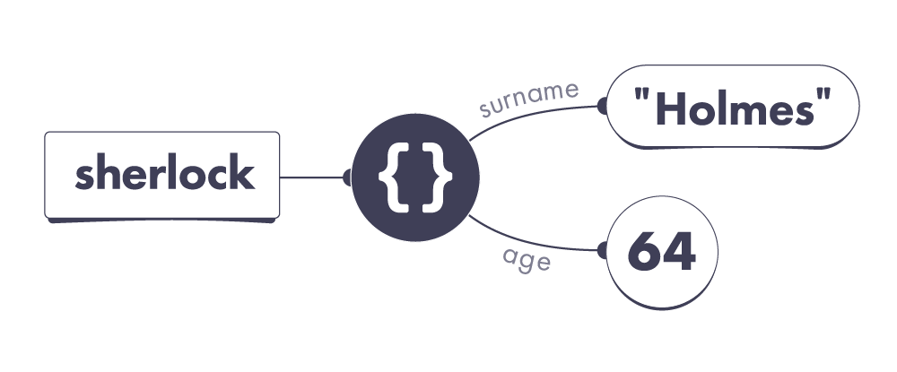
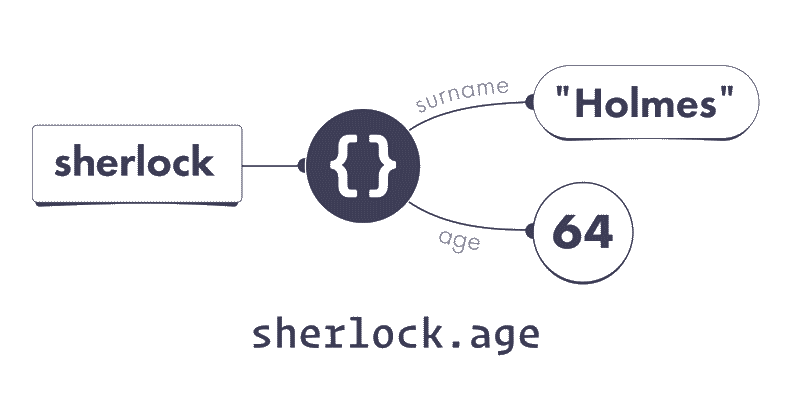
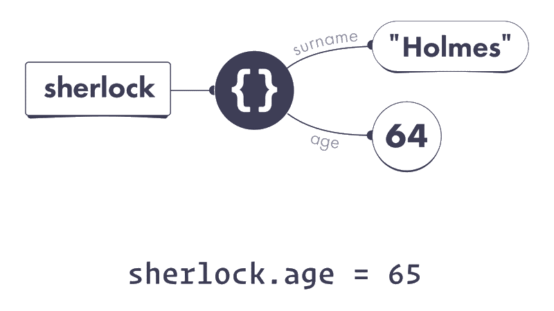
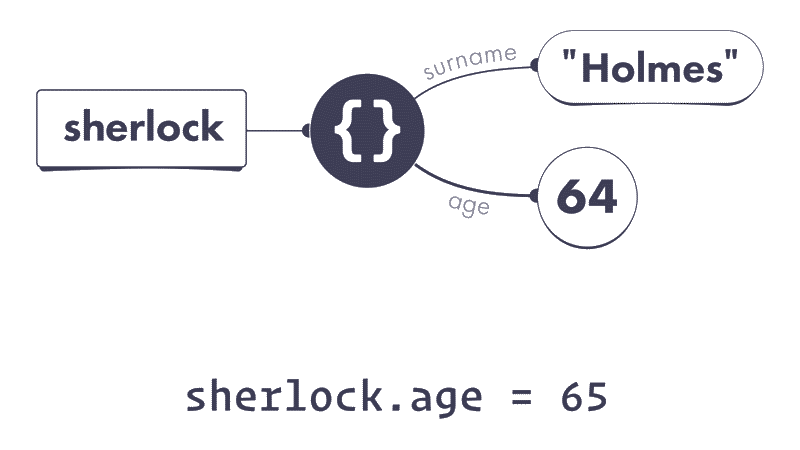
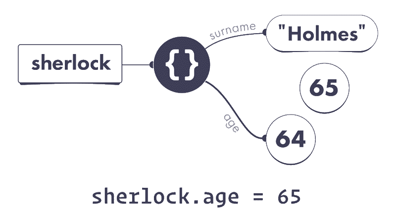

Meet Sherlock Holmes, a world-renowned detective from London:

```js
let sherlock = {
  surname: 'Holmes',
  address: { city: 'London' } 
};
```

His friend John Watson has recently moved in to live with Sherlock:

```js
let john = {
  surname: 'Watson',
  address: sherlock.address
};
```

Sherlock is a brilliant detective but a difficult flatmate. One day, John decides he’s had enough. John changes his surname and moves to live in Malibu:

```js
john.surname = 'Lennon';
john.address.city = 'Malibu';
```

Time for a small exercise. __Write down your answers to these questions:__

```js
console.log(sherlock.surname); // ?
console.log(sherlock.address.city); // ?
console.log(john.surname); // ?
console.log(john.address.city); // ?
```

Before you scroll back up to re-read the code, I want you to approach it in a particular way. Open a sketch app or get paper and pen, and __sketch out your mental model of what happens on every line.__ It’s okay if you’re not sure how to represent it. We haven’t yet discussed these topics so use your best guess.

Then, with the help of your final sketch, answer the four questions above.

__SPOILERS BELOW__

Don’t scroll further until you have written the answers to four questions.

...

...

...

...

...

Now let’s check your answers:

```js
console.log(sherlock.surname); // "Holmes"
console.log(sherlock.address.city); // "Malibu"
console.log(john.surname); // "Lennon"
console.log(john.address.city); // "Malibu"
```

This is not a typo — they are indeed __both in Malibu__. It’s not so easy to get away from Sherlock! With a wrong mental model, one might conclude that `sherlock.address.city` is `"London"` — but it’s not.

To see why, we need to learn how properties work in our JavaScript universe.

# Properties

We’ve talked about objects before. For example, here is a `sherlock `variable pointing to an object value. We create a new object value by writing {}:

```js
let sherlock = {};
```

In our universe, it might look like this:


However, objects are primarily useful to group related data together. For example, we might want to group different things we know about Sherlock:

```js
let sherlock = {
  surname: 'Holmes',
  age: 64,
};
```

Here, `sherlock` is still a variable, but `surname` and age are not. They are `properties`. Unlike variables, properties _belong_ to a particular object.

__In our JavaScript universe, both variables and properties act like “wires”__. However, the wires of properties start from objects rather than from our code:




Here, we can see that the sherlock __variable__ points to an object we have created. That object has two __properties.__ Its `surname` property points to the `"Holmes"` string value, and its age property points to the `64` number value.

Importantly, properties don’t _contain_ values — they point at them! It turns out that our universe is full of wires. Some of them start in our code (variables), and others start from objects (properties). All wires always point at values.

Before reading this, you might have imagined that values live “inside” objects because they appear “inside” in code. This intuition often leads to mistakes, so we will be “thinking in wires” instead. Take one more look at the code and the diagram. Make sure you’re comfortable with them before you continue.

## Reading a Property

We can read a property’s current value by using the “dot notation”:

```js
console.log(sherlock.age); // 64
```

Here, `sherlock.age` is our old friend — _an expression_, a question to the JavaScript universe. To answer it, JavaScript first follows the `sherlock` wire:




It leads to an object. From that object, JavaScript follows the age property.

Our object’s age property points to `64`, so `sherlock.age` results in `64`.

## Property Names

Properties have names. A single object can’t have two properties with the same name. For example, our object can’t have two properties called age.

The property names are always case-sensitive! For example, age and Age would be two completely different properties from JavaScript’s point of view.

If we don’t know a property name ahead of time but we have it in code as a string value, we can use the [] “bracket notation” to read it from an object:

```js
let sherlock = { surname: 'Holmes', age: 64 };
let propertyName = prompt('What do you want to know?');
alert(sherlock[propertyName]); // Read property by its name
```

Try this code in your browser console and enter age when prompted.

## Assigning to a Property

What happens when we _assign a value_ to a property?

`sherlock.age = 65;`

Let’s split this code into the left and the right side, separated by =.

__First, we figure out which wire is on the left side: sherlock.age.__

We follow the `sherlock` wire, and then pick the age property wire:




Note that we don’t _follow_ the age wire to 64. We don’t care what its current value is. On the left side of the assignment, we are looking for __the wire itself.__

Remember which wire we picked? Carry on.

__Next, we figure out which value is on the right side: `65`.__

Unlike the left side, the right side of an assignment always expresses a value. In this example, the right side’s value is the number value `65`. 
Let’s summon it:





Now we are ready to perform the assignment.

__At last, we point the wire on the left side to the value on the right side:__




And we’re done! From now on, reading `sherlock.age` would give us 65.

## Missing Properties

You might wonder what happens if we read a property that doesn't exist:

```js
let sherlock = { surname: 'Holmes', age: 64 };
console.log(sherlock.boat); // ?
```

We know that `sherlock.boat` is a property expression. The JavaScript universe follows certain rules to decide which value to “answer” us with.

__These rules look roughly like this:__

1. Figure out the value of the part before the dot `(.)`.
2. If that value is `null` or `undefined`, throw an error immediately.
3. Check whether a property with that name exists in our object.
    a. If __it exists__, answer with the value this property points to.
    b. If __it doesn’t exist__, answer with the undefined value.

Note these rules are a bit simplified, and we will need to amend them in the future modules. Still, they already tell us a lot about how JavaScript works!

For example, sherlock points to an object that __doesn’t__ have a `boat` property. So `sherlock.boat` gives us undefined as an answer:

```js
let sherlock = { surname: 'Holmes', age: 64 };
console.log(sherlock.boat); // undefined
```

Note __this does not mean__ that our object has a boat property pointing to undefined! It only has two properties, and neither of them is called boat:


It is tempting to think sherlock.boat directly corresponds to the concept of a property in our mental model, but __that’s not quite correct.__ It is a question to the JavaScript engine — and so the engine follows the rules to answer it.

It looks at the object that sherlock points to, sees that it __doesn’t__ have a `boat` property, and gives us back the undefined value because __that’s what the rules say__. There is no deeper reason to this: computers follow the rules.

Scroll up and re-read the rules again. Can you apply them in practice?

```js
let sherlock = { surname: 'Holmes', age: 64 };
console.log(sherlock.boat.name); // ?
```

What happens if we run this code? __Don’t guess — follow the rules.__

Hint: there are two dots, so you need to follow the rules two times.


__SPOILERS BELOW__

Don’t scroll further until you have decided on an answer.

...

...

...
 
The answer is that calculating `sherlock.boat.name` __throws an error__:

- We need to first figure out the value of `sherlock.boat`.
    - To do that, we need to figure out the value of `sherlock`.
        - The wire from `sherlock` variable leads to an object.
        - Therefore, the value of `sherlock` is that object.
    - An object is not `null` or `undefined`, so we keep going.
    - That object __does not__ have a `boat` property.
    - Therefore, the value of `sherlock.boat` is `undefined`.
- We’ve got `undefined` on the left side of the dot `(.)`.
- The rules say that null or `undefined` on the left side is an error.

```js
let sherlock = { surname: 'Holmes', age: 64 };
console.log(sherlock.boat); // undefined
console.log(sherlock.boat.name); // TypeError!
```

If this still seems confusing, scroll up and mechanically follow the rules.

# Recap

- Properties are wires — a bit like variables. They both point at values. Unlike variables, properties __start from objects__ in our universe.
- Properties have names. Properties belong to particular objects. You can’t have more than one property with the same name on an object.
- Generally, you can perform an assignment in three steps:
    1. Figure out which wire is on the left.
    2. Figure out which value is on the right.
    3. Point that wire to that value.
- An expression like `obj.property` is calculated in three steps:
    1. Figure out which value is on the left.
    2. If it’s `null` or `undefined`, throw an error.
    3. If that property exists, the result is the value its wire points to.
    4. If that property doesn’t exist, the result is `undefined`.

Note that this mental model of properties is still a bit simplified. It is good enough for the next few modules, but we will need to expand it in the future.

If you got confused by the Sherlock Holmes example in the beginning, you can optionally get back to it and try to follow it with our new mental model. The next module will include a detailed walkthrough of it in case you’re still not quite sure why it works this way. Try to get used to seeing properties as wires.

# Exercises

This module also has exercises for you to practice!

[__Click here__ to solidify this mental model with a few short exercises.](https://eggheadio.typeform.com/to/IDJBPQ)

__Don’t skip them!__

Even though you’re probably familiar with the concept of properties, these exercises will help you cement the mental model we’re building. We need this foundation before we can get to more complex topics.

I'm still working on the next module. You can expect to see it in a week or so.


​

